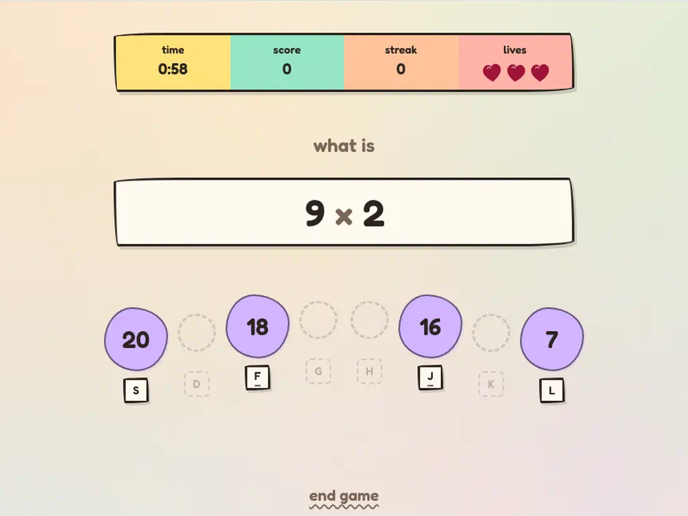
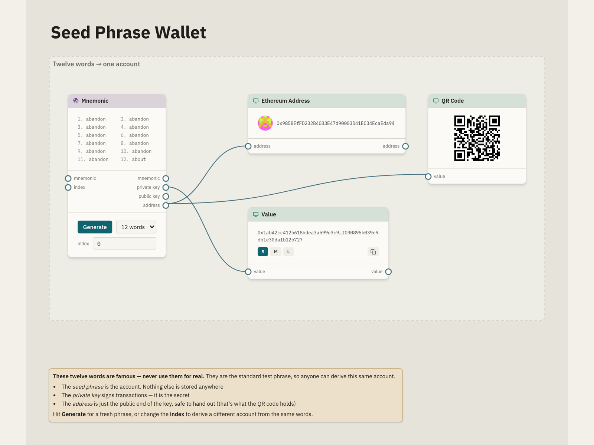
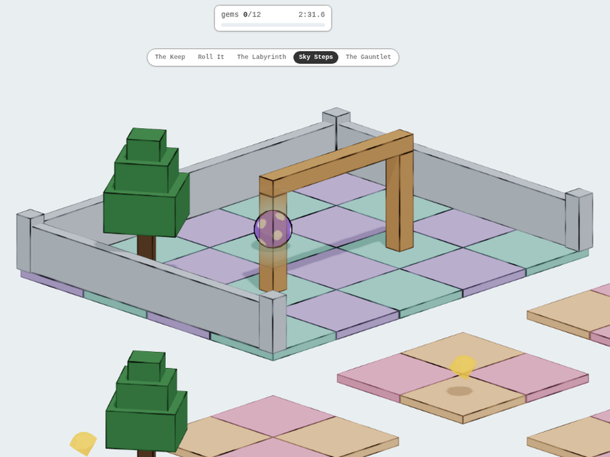
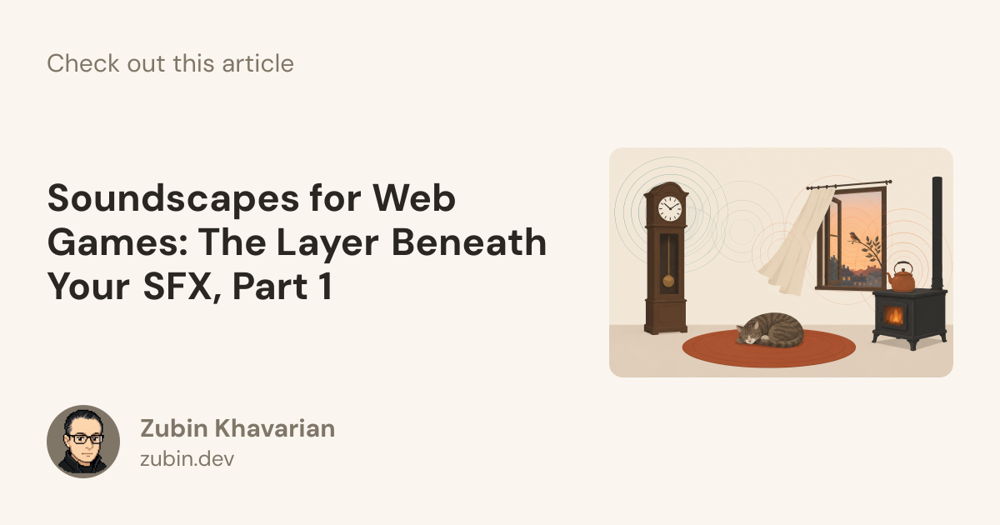
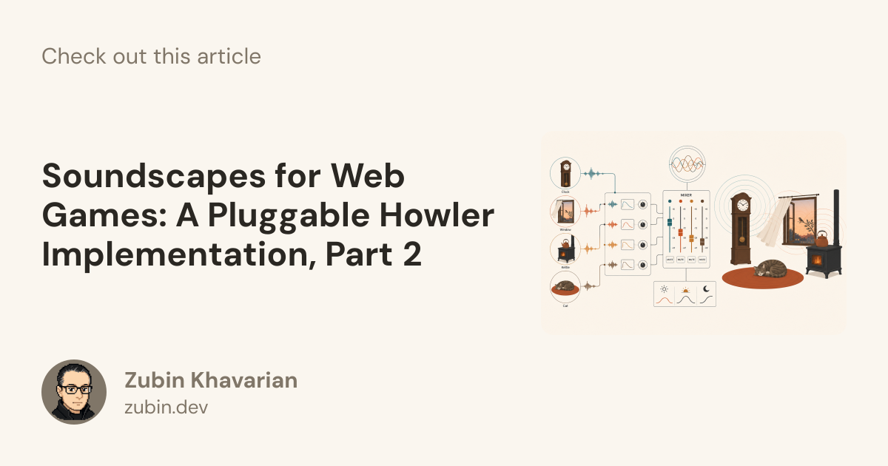

### Hi, I'm Zubin

I spend most of my time on front-end architecture in React and TypeScript, including 3D work in Three.js / React Three Fiber.

I also write about web games and the unglamorous parts of shipping on the web.

**[zubin.dev](https://zubin.dev)** · **[LinkedIn](https://www.linkedin.com/in/zubinkhavarian)** · **[X](https://x.com/zkMake)**

---

## Projects

Things you can open in a browser. More at [zubin.dev/projects](https://zubin.dev/projects/).

<table>
  <tr>
    <td width="58%" valign="top">
      
    </td>
    <td width="42%" valign="top">
      <h3><a href="https://mathness.pages.dev/">Mathness!</a></h3>
      
A timed math drill built as a PWA for a phone in portrait. Two minutes, three lives, four-choice questions. Works on desktop too.

      
<a href="https://mathness.pages.dev/">Play</a>

    </td>
  </tr>
  <tr>
    <td width="58%" valign="top">
      
    </td>
    <td width="42%" valign="top">
      <h3><a href="https://learn-eth.pages.dev/">learn-eth</a></h3>
      
A node canvas for timers, QR codes, logic gates, and displays. Draw wires and watch values update live. Inspired by Austin Griffith’s <a href="https://eth.build/">eth.build</a>. React Flow.

      
<a href="https://learn-eth.pages.dev/">Open</a>

    </td>
  </tr>
  <tr>
    <td width="58%" valign="top">
      
    </td>
    <td width="42%" valign="top">
      <h3><a href="https://roll-it.pages.dev/">Roll It</a></h3>
      
WASD a ball over floating tile islands and collect gems. Rapier physics, a sketch shader, and scenery that turns see-through when you roll behind it. React Three Fiber + Three.js.

      
<a href="https://roll-it.pages.dev/">Play</a>

    </td>
  </tr>
</table>

---

## Writing

A two-part series on the audio layer most web games skip.

<table>
  <tr>
    <td width="50%" valign="top">
      
      

        <strong><a href="https://zubin.dev/blog/web-game-soundscapes-1-concepts/">Soundscapes for Web Games, Part 1</a></strong> 
        The layer beneath your SFX. Why a looping room-tone is not enough, and the knobs that keep a bed from sounding like a tape.
      

    </td>
    <td width="50%" valign="top">
      
      

        <strong><a href="https://zubin.dev/blog/web-game-soundscapes-2-howler/">Soundscapes for Web Games, Part 2</a></strong> 
        A pluggable Howler implementation. One class under a hundred lines, a six-function bus adapter, and host bindings for React, Phaser, and three.js.
      

    </td>
  </tr>
</table>

More on [zubin.dev/blog](https://zubin.dev/blog/).
