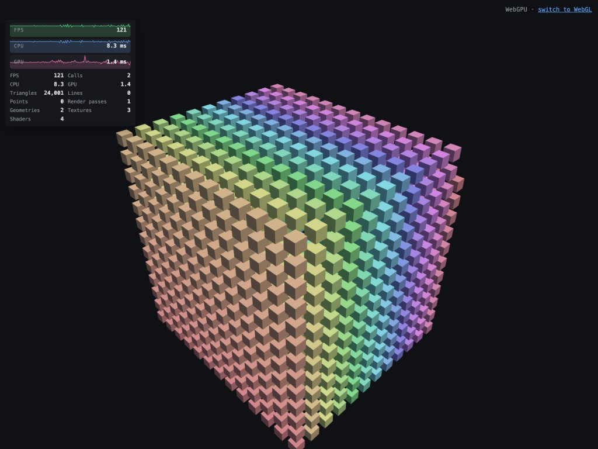
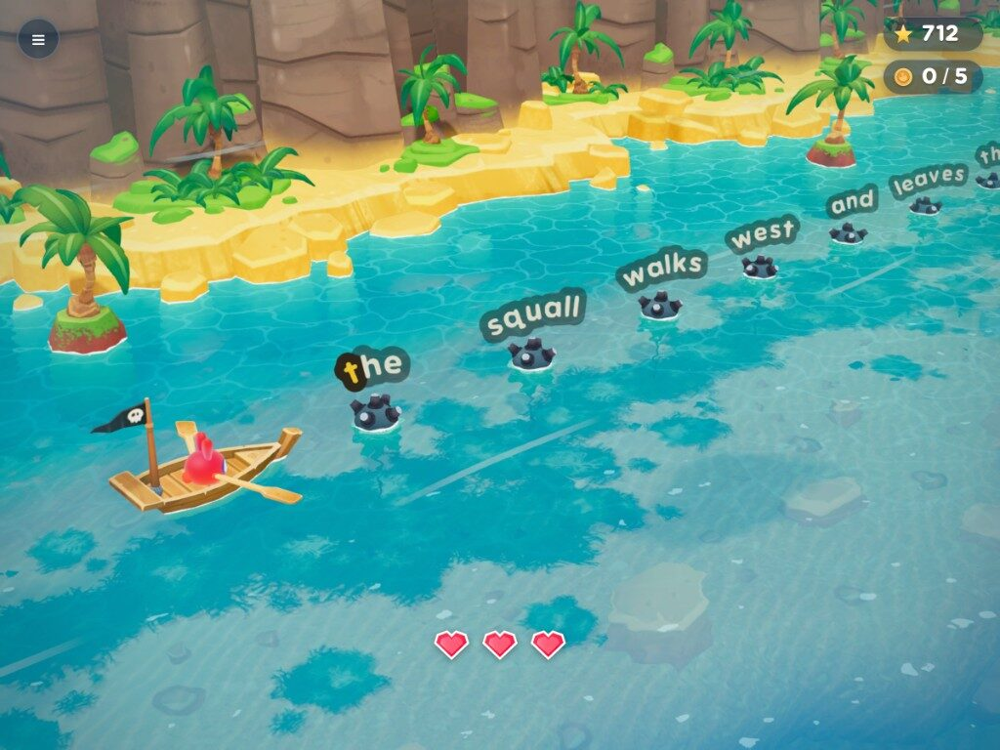
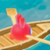
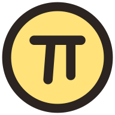
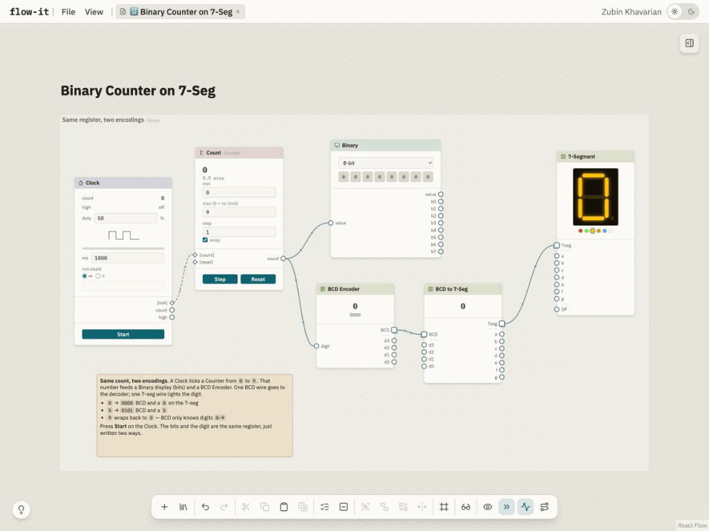
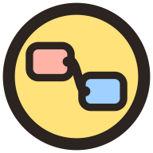
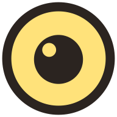
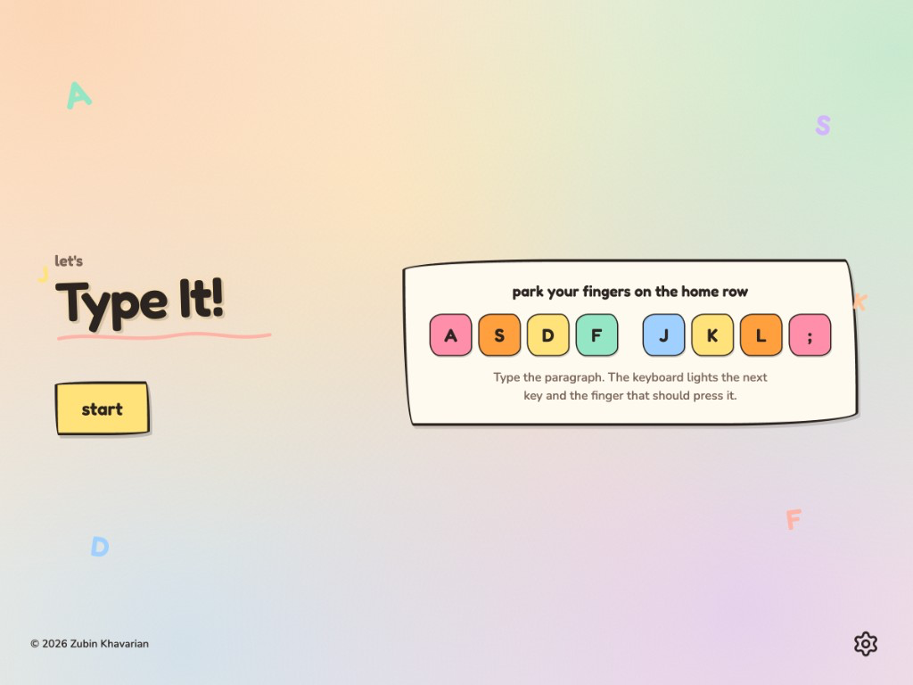
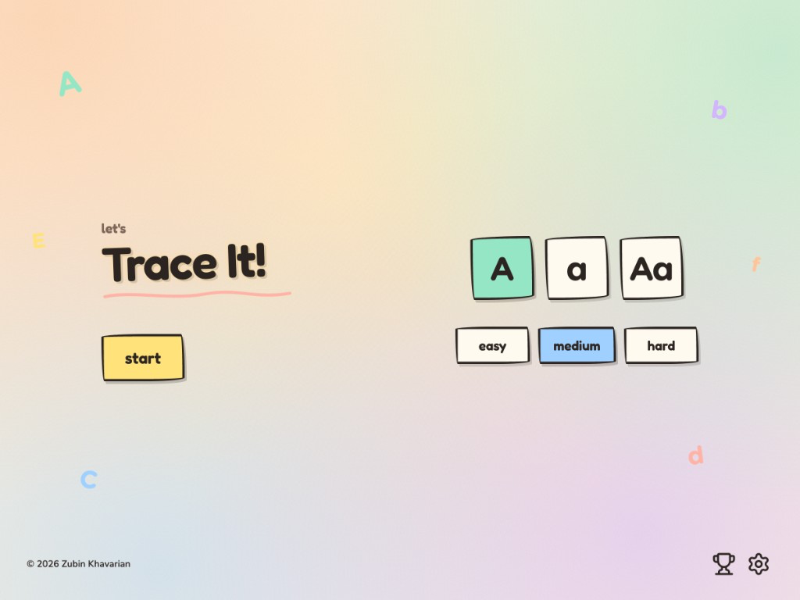
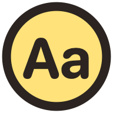

### Hey, I'm Zubin

I build for the web and write about what I learn along the way. React, TypeScript, Three.js, game-dev, and AI-native engineering.

  <a href="https://zubin.dev">&nbsp;zubin.dev</a>
  &nbsp;·&nbsp;
  <a href="https://github.com/zkmake">&nbsp;GitHub</a>
  &nbsp;·&nbsp;
  <a href="https://x.com/zkmake">&nbsp;X</a>
  &nbsp;·&nbsp;
  <a href="https://www.linkedin.com/in/zubinkhavarian">&nbsp;LinkedIn</a>

---

## Writing

A two-part series on the audio layer most web games skip.

**[Soundscapes for Web Games: The Layer Beneath Your SFX, Part 1](https://zubin.dev/blog/web-game-soundscapes-1-concepts/)**  
Web games sound flat because they treat audio as event SFX. A soundscape is the layer that fills the silence.

**[Soundscapes for Web Games: A Pluggable Howler Implementation, Part 2](https://zubin.dev/blog/web-game-soundscapes-2-howler/)**  
The soundscape engine is one class under a hundred lines. A six-function adapter is the seam.

More on [zubin.dev/blog](https://zubin.dev/blog/).

---

## Projects

Educational games and tools you can open in a browser. More at [zubin.dev/projects](https://zubin.dev/projects/).

**[three-meter](https://three-meter.pages.dev/)**  
A zero-dependency three.js HUD for FPS, CPU, GPU, draw calls, and scene counts. The sampler and the card stay separate so toggling the HUD never remounts the canvas. Works with vanilla three and React Three Fiber.  
[Open](https://three-meter.pages.dev/) · [GitHub](https://github.com/zkmake/three-meter) · [npm](https://www.npmjs.com/package/@zkmake/three-meter)

 

&nbsp;

 **[Typo's Voyage](https://typos-voyage.edclub.io/)**  
Typo rows a boat through tropical water and types words to clear mines and other obstacles on a voyage to get faster. I led the 3D team at [edclub](https://www.edclub.com/) that built it. Three.js.  
[Play](https://typos-voyage.edclub.io/)

 

&nbsp;

 **[Mathness!](https://mathness.pages.dev/)**  
It's a timed math drill made for a phone in portrait. You can play it in a desktop browser too. It is a PWA. Add it as a bookmark on your phone.  
[Play](https://mathness.pages.dev/)

 

&nbsp;

 **[connect-it](https://connect-it-7rt.pages.dev/)**  
You place timers, QR codes, logic gates, displays, and music nodes on a canvas and draw wires between them. Values update on the edges as you edit. An extensive node library helps you find nodes and learn about each, and a starter template library comes with it. Inspired by Austin Griffith’s [eth.build](https://eth.build/), which I still think is amazing. React Flow.  
[Open](https://connect-it-7rt.pages.dev/)

 

&nbsp;

 **[roll-it](https://roll-it.pages.dev/)**  
WASD rolls a ball over floating tile islands while you collect gems. Rapier runs the physics. A sketch shader inks the world. When the ball rolls behind a wall or a tree, that scenery turns see-through. React Three Fiber + Three.js.  
[Play](https://roll-it.pages.dev/)

 

&nbsp;

 **[type-it](https://type-it.pages.dev/)**  
It's a kids typing tutor for a tablet or desktop in landscape. You type a short paragraph while an on-screen keyboard lights the next key and the home-row finger.  
[Play](https://type-it.pages.dev/)

 

&nbsp;

 **[trace-it](https://trace-it.pages.dev/)**  
It's a letter-tracing drill. You pick uppercase, lowercase, or mixed English letters and trace them. It is a PWA.  
[Play](https://trace-it.pages.dev/)

 
